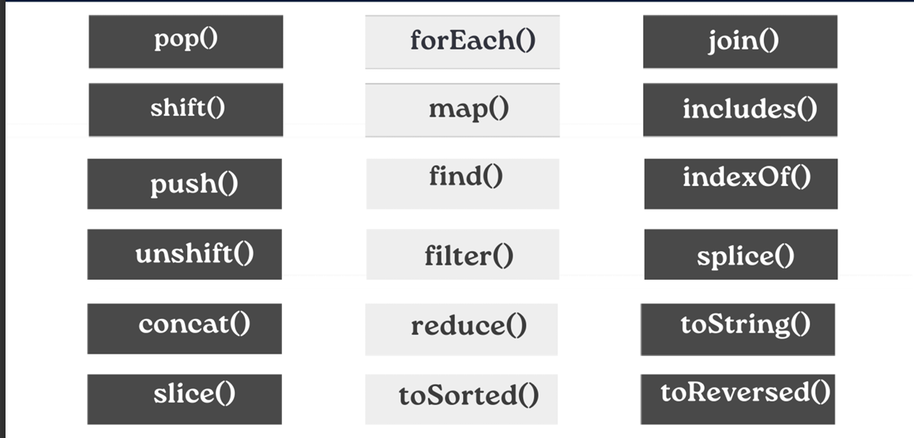
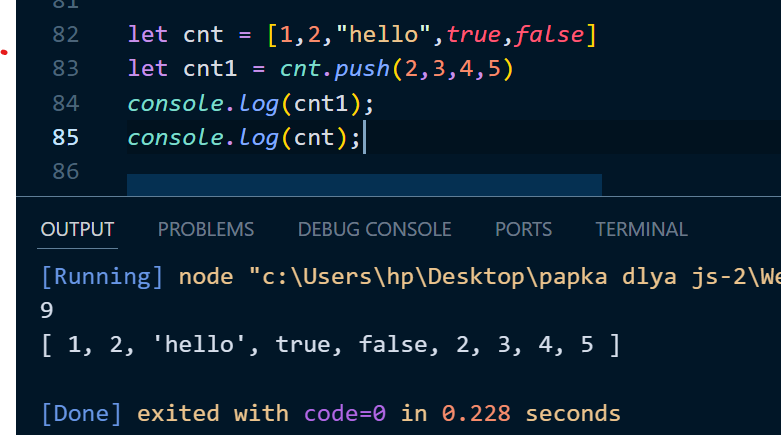
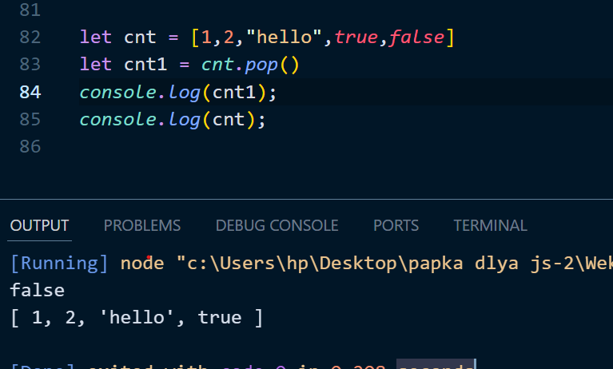
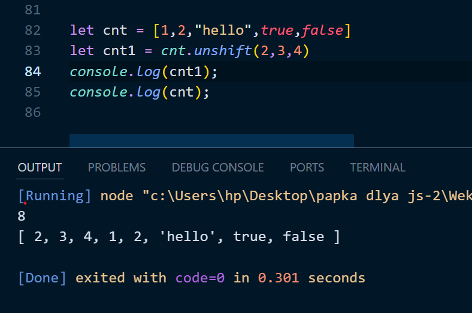
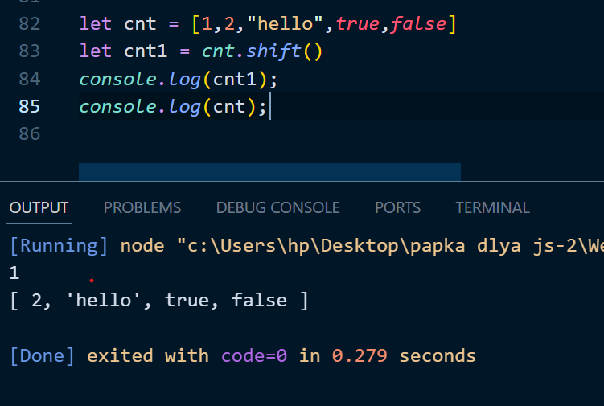
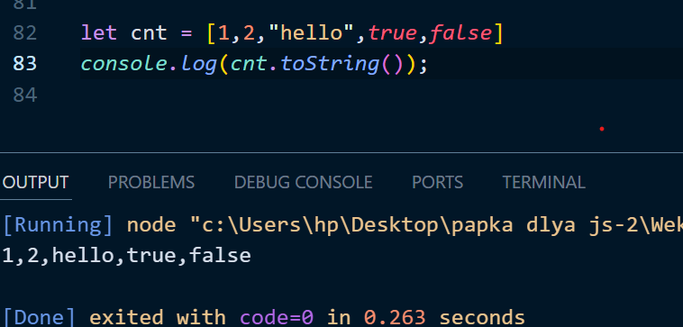
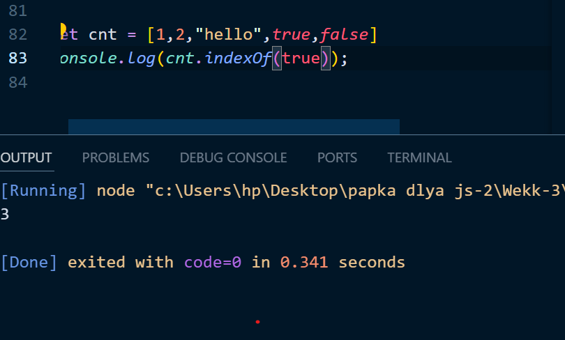
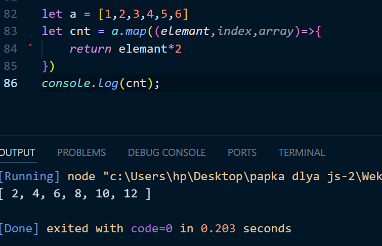
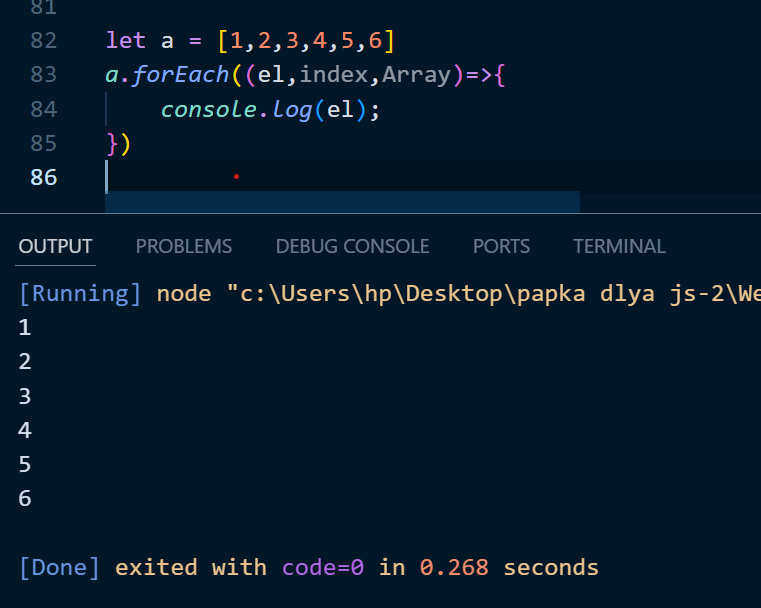
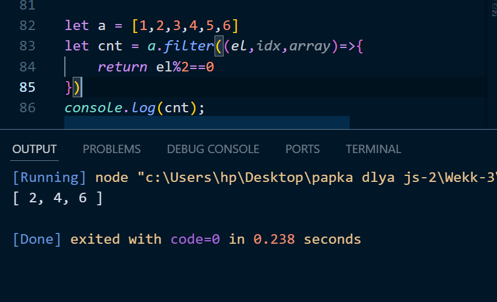

# `Что такое массив в JavaScript ?`
## Массивы в JavaScript представляют собой спископодобные структуры, которые предназначены для хранения упорядоченных данных. Можно сказать, что для хранения нескольких строк позволено использовать объекты.

# `Array Метод`

# `Что такой push ?`
## Метод push() в JavaScript добавляет один или более элементов в конец массива и возвращает новую длину массива.

 

# `Что такой pop ?`
## Метод pop() в JavaScript удаляет последний элемент из массива и возвращает его значение.

 

# `Что такой  unshift?`
## Метод unshift() в JavaScript добавляет один или более элементов в начало массива и возвращает новую длину массива.

 

# `Что такой  shift?`
## JavaScript метод shift () позволяет удалить первый элемент из массива (элемент с индексом 0) и возвратить его значение. новую длину массива.

 

# `Что такой  toString?`
## Метод toString() возвращает строку, представляющую объект.

 

# `Что такой  indexOf ?`
## Метод indexOf () — это метод в JavaScript, который ищет указанный элемент в массиве или строке.

 

# `Javascript Array Метод callback`

 

# `Что такой  map() ?`
## Метод map() в JavaScript позволяет трансформировать один массив в другой при помощи функций-колбэка.

 

# `Что такой  ForEach() ?`
## Метод forEach в JavaScript используется для перебора элементов массива.

 

# `Что такой  Filter() ?`
## Метод filter() в JavaScript используется для фильтрации массивов.

